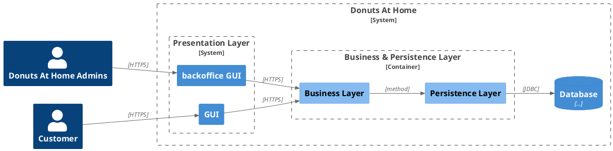
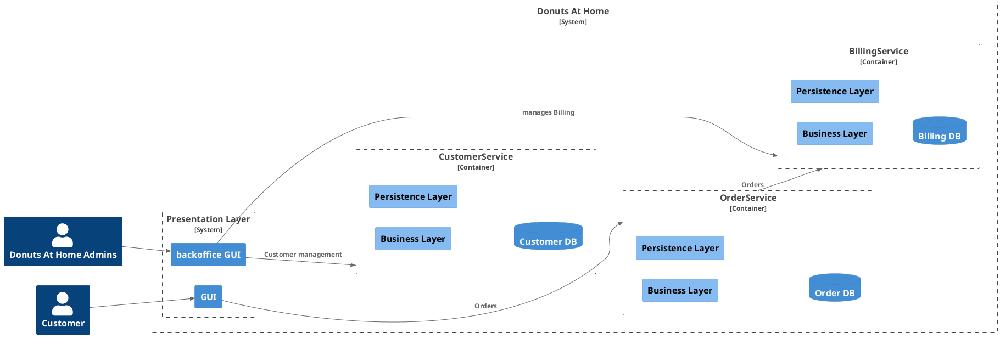

# Introduction
Ce cours vise à introduire les concepts fondamentaux des architectures microservices.

Les points abordés seront:

* Fondamentaux (Pourquoi? Les défis, comment les concevoir)
* Protocoles (HTTP, REST, GRAPHQL, GRPC)
* Couplage lâche
* Cohérence des données, transactions distribuées et utilisation de messageries asynchrones
* Les bases de données
* Gestion des pannes et erreurs
* La sécurité
* Comment casser un monolithe

--- 
layout: quote
---

# Fondamentaux

## Définition d' Amazon

> Microservices are an architectural and organizational approach to software development where software is composed of small independent services that communicate over well-defined APIs. These services are owned by small, self-contained teams.
> 
> 
> Microservices architectures make applications easier to scale and faster to develop, enabling innovation and accelerating time-to-market for new features.


---

## Monolithe vs Microservices

### Un monolithe



Tous les composants sont déployés dans le même livrable et sur la même machine.

---

### Une plateforme microservices


Chaque domaine fonctionnel est déployé indépendamment.

---

## Pourquoi ?

* Donner plus d'autonomie aux équipes en charge d'un microservice
* Faciliter la gestion du changement par des déploiements plus unitaires et modules (c.-à-d. plus petits)
* Favoriser l'innovation
* Utiliser la technologie la plus appropriée pour chaque service
* Améliorer et cibler la scalabilité

--- 

## Principes de base

Chaque microservice est composé d'une API et une base de données ou tout autre moyen de stockage (si nécessaire).

Il est développé et opéré par une _"Pizza Team"_ qui fait tout du dev à la prod

Les fonctionnalités ne sont accessibles que par le biais des API --> On n'accède pas directement à la base de données.




---

# Protocoles

Il y a deux types de flux utilisés dans les connexions entre services :

* Synchrones: Utilisation de protocoles basés sur HTTP ou GRPC
* Asynchrones: Utilisation de messageries asynchrones ou streaming de de données

---

## Transactions synchrones

Deux grandes familles de protocole sont utilisées dans les transactions synchrones


| Fonctionnalité               | gRPC                         | API HTTP avec JSON          |
|------------------------------|------------------------------|-----------------------------|
| Contrat                      | Obligatoire (.proto)         | Facultatif (OpenAPI)        |
| Protocole                    | HTTP/2                       | HTTP                        |
| Payload                      | Protobuf (petit, binaire)    | JSON (grand, lisible par l’homme) |
| Diffusion en continu         | Client, serveur, bidirectionnel | Client, serveur          |
| Prise en charge des navigateurs | Non (nécessite grpc-web)  | Oui                         |
| Sécurité                     | Transport (TLS)              | Transport (TLS)             |
| Génération de code client    | Oui                          | OpenAPI + outils tiers      |


---

## API HTTP 

Les API basées sur HTTP utilisent soit GraphQL ou REST (majoritaire).

### Les API REST 

Les API REST (Representational State Transfer) sont un style architectural pour la conception de services web. Elles utilisent les protocoles et les standards du web, principalement HTTP, pour permettre la communication entre un client et un serveur. 

--- 

Voici quelques points clés concernant les API REST :

1. Ressources (ex. ``/users/{userId}``)
2. Verbes HTTP: 
* ``GET`` : Récupérer une ressource ou une collection de ressources. (ex. ``/users/1``)
* ``POST`` : Créer une nouvelle ressource. (ex. Envoi d'un formulaire à la ressource ``/users``)
* ``PUT`` : Mettre à jour une ressource existante.
* ``DELETE`` : Supprimer une ressource.
* ``PATCH``: Mettre à jour une partie d'une ressource existante
3. Sans état (stateless)
4. Possibilité de mettre en cache les requêtes
5. Représentation (ex. JSON)
6. Interface uniforme
7. Scalabilité et performance


<!-- 
Vous avez dit :
transforme ce tableau en syntaxe markdown


Fonctionnalité 	gRPC 	API HTTP avec JSON
Contrat 	Obligatoire (.proto) 	Facultatif (OpenAPI)
Protocol 	HTTP/2 	HTTP
Payload 	Protobuf (petit, binaire) 	JSON (grand, lisible par l’homme)
Prescriptivité 	Spécification stricte 	Lâche. Tout HTTP est valide.
Diffusion en continu 	Client, serveur, bidirectionnel 	Client, serveur
Prise en charge des navigateurs 	Non (nécessite grpc-web) 	Oui
Sécurité 	Transport (TLS) 	Transport (TLS)
Génération de code client 	Oui 	OpenAPI + outils tiers
ChatGPT a dit :
ChatGPT

Voici le tableau transformé en syntaxe Markdown :

Les API REST (Representational State Transfer) sont un style architectural pour la conception de services web. Elles utilisent les protocoles et les standards du web, principalement HTTP, pour permettre la communication entre un client et un serveur. Voici quelques points clés concernant les API REST :

    Ressources : Dans REST, tout est considéré comme une ressource, identifiée par une URI (Uniform Resource Identifier). Par exemple, une ressource utilisateur peut être accessible via /users/{userId}.

    Verbes HTTP : Les API REST utilisent les verbes HTTP pour indiquer l'action à effectuer sur une ressource :
        GET : Récupérer une ressource ou une collection de ressources.
        POST : Créer une nouvelle ressource.
        PUT : Mettre à jour une ressource existante.
        DELETE : Supprimer une ressource.

    Stateless : Les API REST sont sans état (stateless). Chaque requête du client au serveur doit contenir toute l'information nécessaire pour comprendre et traiter la requête. Le serveur ne doit pas stocker de contexte client entre les requêtes.

    Cacheabilité : Les réponses des API REST peuvent être mises en cache pour améliorer les performances. Les réponses doivent indiquer si elles sont cacheables ou non.

    Représentations : Les ressources peuvent être représentées sous différentes formes, telles que JSON, XML, HTML, etc. Le client peut spécifier le format souhaité via l'en-tête Accept, et le serveur renvoie la représentation appropriée.

    Uniform Interface : Une interface uniforme est une contrainte clé du REST qui simplifie et décentralise l'architecture. Elle se compose de :
        Identification des ressources.
        Manipulation des ressources par des représentations.
        Messages auto-descriptifs.
        Hypermedia comme le moteur de l'état de l'application (HATEOAS).

    Scalabilité et performance : En étant sans état et en permettant la mise en cache, les API REST peuvent facilement être mises à l'échelle et offrent de bonnes performances.

Les API REST sont largement utilisées en raison de leur simplicité, de leur flexibilité et de leur compatibilité avec les standards web existants.

-->

---

#### HATEOAS

HATEOAS (Hypermedia As The Engine Of Application State) est une contrainte de l'architecture REST selon laquelle un client interagit avec une application entièrement par le biais de ressources dynamiques fournies par le serveur. Ces ressources contiennent des liens hypermedia qui indiquent les actions possibles et les transitions d'état. 

**Caractéristiques de HATEOAS**

1. Auto-découverte
2. Navigation par liens
3. Dynamisme

<!-- 
1. Auto-découverte : Le client découvre les actions possibles et les transitions d'état via des liens hypermedia inclus dans les réponses du serveur.
2. Navigation par liens : Les réponses du serveur contiennent des liens vers d'autres ressources, permettant au client de naviguer dans l'API de manière intuitive.
3. Dynamisme : Les API peuvent évoluer sans nécessiter de modifications côté client, car les liens et les actions sont déterminés dynamiquement à chaque interaction.


-->


---

**Exemple**

Voici une API pour une boutique en ligne. Une réponse pour obtenir les détails d'un produit pourrait ressembler à ceci en utilisant JSON :

```json
{
  "id": 123,
  "name": "Chaussures de course",
  "price": 50,
  "links": [
    {
      "rel": "self",
      "href": "http://api.boutique.com/products/123"
    },
    {
      "rel": "add-to-cart",
      "href": "http://api.boutique.com/cart/add/123"
    },
    {
      "rel": "reviews",
      "href": "http://api.boutique.com/products/123/reviews"
    }
  ]
}
``` 


---
layout: two-cols
---
#### Modèle de maturité de Richardson

> Ce modèle évalue la maturité d'une API REST en quatre niveaux (0 à 3), chacun  ajoutant des caractéristiques supplémentaires qui rapprochent l'API des principes RESTful.

1. **Niveau 0** : Appels à distance uniques
Exemple : Une API avec une seule URL qui accepte différentes actions via des paramètres.

2. **Niveau 1** : Utilisation des ressources
Exemple :
* ``GET /users/getUser?id=123``
* ``POST /users/createUser`` 

3. **Niveau 2** : Verbes HTTP
Exemple :
* ``GET /users/123`` (récupérer les détails de l'utilisateur avec l'ID 123)
* ``POST /users`` (créer un nouvel utilisateur)
* ``PUT /users/123`` (mettre à jour l'utilisateur avec l'ID 123)
* ``DELETE /users/123`` (supprimer l'utilisateur avec l'ID 123)

::right::

4. **Niveau 3** : Hypermedia Controls

À ce niveau, l'API intègre des hyperliens dans les réponses pour guider les clients sur les actions possibles. 

**Exemple de réponse HATEOAS**

```json
{
  "id": 123,
  "name": "Jane Doe",
  "links": [
    {
      "rel": "self",
      "href": "/users/123"
    },
    {
      "rel": "friends",
      "href": "/users/123/friends"
    },
    {
      "rel": "update",
      "href": "/users/123"
    }
  ]
}

```

---

### GraphQL

GraphQL est un langage de requête pour les API. Il a été développé par Facebook en 2012 et open-source en 2015. 

GraphQL permet aux clients de demander précisément les données dont ils ont besoin, et rien de plus

#### Principes

1. Langage de requête
* GraphQL permet aux clients de définir la structure des réponses qu'ils souhaitent recevoir.
* Les requêtes GraphQL sont envoyées au serveur et le serveur retourne uniquement les données demandées.

2. Schéma fortement typé

3. Récupération de l'équivalent de plusieurs ressources en une seule requête 

---
layout: two-cols
backgroundSize: 20em
---

**Exemple de requête**

```graphql {*}{maxWidth:'100px'}
{
  user(id: "1") {
    id
    name
    friends {
      id
      name
    }
  }
}

```
::right::

**Exemple de réponse**

```graphql
{
  "data": {
    "user": {
      "id": "1",
      "name": "Alice",
      "friends": [
        {
          "id": "2",
          "name": "Bob"
        },
        {
          "id": "3",
          "name": "Charlie"
        }
      ]
    }
  }
}


```
---

### En résumé

| Technologie | Avantages | Inconvénients |
| --- | --- | --- |
| REST | Simplicité de mise en oeuvre , Stateless, interopérabilité, utilisation des standards du Web | Manque de fléxibilité dans les requêtes, gestion des versions, évolutivité, surcharge réseau |
| GrahQL | Flexibilité, efficacité, évolutivité, documentation automatique | Pas de cache possible, tout passe par une requête POST, complexité de mise en oeuvre |

::right::

#### Avantages de GraphQL

* Flexibilité
* Efficacité
* Evolutivité
* Documentation automatique

<!--
* Flexibilité : Les clients peuvent demander exactement les données dont ils ont besoin, réduisant ainsi la quantité de données transférées.
* Efficacité : Une seule requête peut récupérer toutes les données nécessaires, réduisant le nombre de requêtes HTTP nécessaires.
* Évolutivité : Les API peuvent évoluer sans rompre les requêtes existantes, car les clients demandent explicitement les champs dont ils ont besoin.
* Documentation automatique : Le schéma GraphQL fournit une documentation automatique de l'API, facilitant la compréhension et l'utilisation par les développeurs.
-->