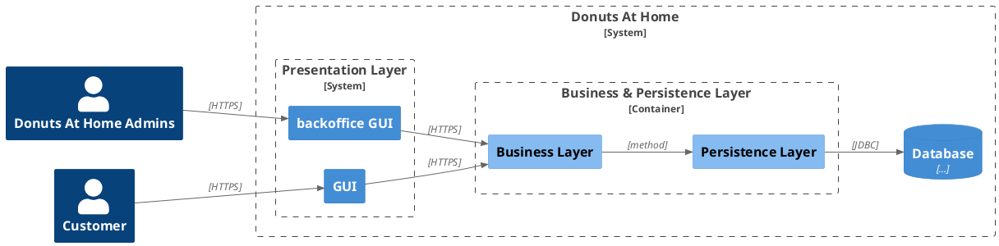
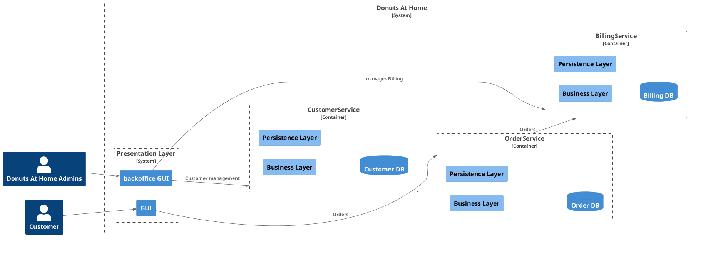

--- 
layout: quote
---

# Fondamentaux

## Définition d' Amazon

> Microservices are an architectural and organizational approach to software development where software is composed of small independent services that communicate over well-defined APIs. These services are owned by small, self-contained teams.
> 
> 
> Microservices architectures make applications easier to scale and faster to develop, enabling innovation and accelerating time-to-market for new features.

---

## Monolithe vs Microservices

### Un monolithe

Tous les composants sont déployés dans le même livrable et sur la même machine.

---

### Une plateforme microservices

Chaque domaine fonctionnel est déployé indépendamment.

---

## Pourquoi ?

* Donner plus d'autonomie aux équipes en charge d'un microservice
* Faciliter la gestion du changement par des déploiements plus unitaires et modules (c.-à-d. plus petits)
* Favoriser l'innovation
* Utiliser la technologie la plus appropriée pour chaque service
* Améliorer et cibler la scalabilité

--- 

## Principes de base

Chaque microservice est composé d'une API et une base de données ou tout autre moyen de stockage (si nécessaire).

Il est développé et opéré par une _"Pizza Team"_ qui fait tout du dev à la prod

Les fonctionnalités ne sont accessibles que par le biais des API --> On n'accède pas directement à la base de données.

