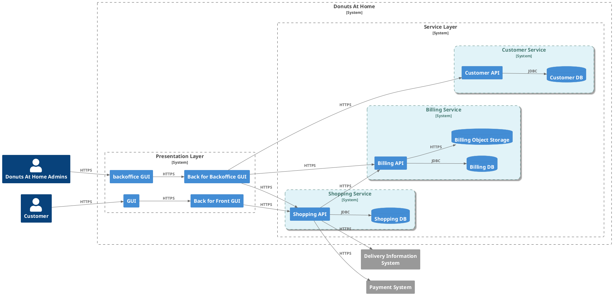
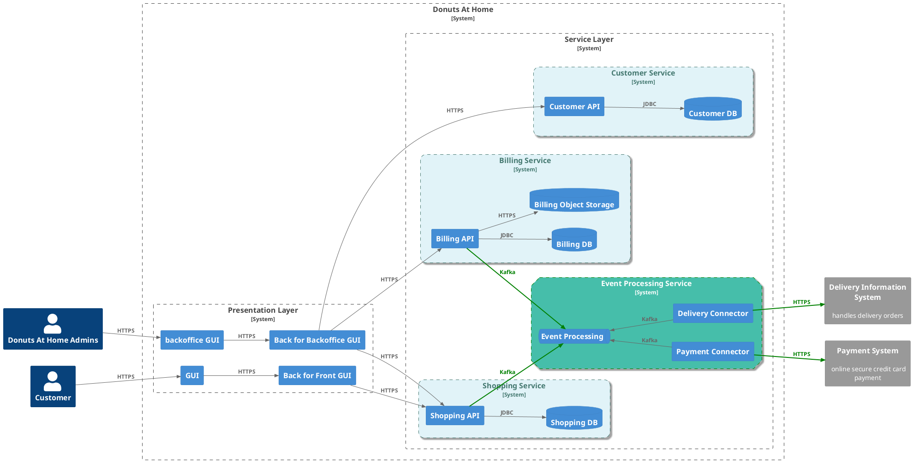

# Couplage

---
layout: center
--- 

## Définition

Le couplage est une métrique indiquant le niveau d'interaction entre deux ou plusieurs composants logiciels (fonctions, modules, objets ou applications). 

Deux composants sont dits couplés s'ils échangent de l'information. On parle de couplage fort ou couplage serré(fort) si les composants échangent beaucoup d'information. 

On parle de couplage faible, couplage léger ou couplage lâche si les composants échangent peu d'information et/ou de manière désynchronisée. 

Source: Wikipedia[@loose-coupling-wikipedia]

<mdi-HeadLightbulbOutline/> **Une bonne architecture logicielle nécessite le couplage le plus faible possible!** 

---

## Qu'est-ce qui crée un couplage dans les architectures microservices ?

### Couplage comportemental

* Description : Se produit lorsque des services partagent des responsabilités dans les processus métier. 
* Conséquence : Si un service nécessite l'aide directe d'un autre pour accomplir ses tâches, cela indique que les périmètres des services n'ont pas été correctement définis.

### Couplage des connaissances

* Description : Se produit lorsque les services connaissent trop bien les implémentations internes des autres.

### Couplage des schémas

* Description : Se produit lorsque les services sont liés à un ensemble commun d'interfaces ou de schémas.

---

### Couplage temporel

* Description : Se produit lorsqu'un service attend une réponse immédiate d'un autre avant de pouvoir continuer.

### Couplage des processus

* Description : Se produit lorsque les services commencent à assumer trop de responsabilités distinctes.
* Conséquence : Donne lieu à des implémentations de services difficiles à mettre à l'échelle ou à modifier. 

### Couplage d'implémentation

* Description : Se produit lorsque les services partagent des détails d'implémentation plutôt que des contrats ou des schémas.
* Conséquence : Les API qui laissent échapper des détails d'implémentation.

### Couplage basé sur la localisation :

* Description : Se produit lorsqu'un service s'attend à ce qu'une ressource existe à un emplacement spécifique.

<!-- 
Couplage comportemental :

Description : Se produit lorsque des services partagent des responsabilités dans les processus métier. Par exemple, plusieurs services peuvent être impliqués dans la production d'une facture.
Conséquence : Si un service nécessite l'aide directe d'un autre pour accomplir ses tâches, cela indique que les périmètres des services n'ont pas été correctement définis.
Solution : Redéfinir les frontières entre services pour éliminer les communications excessivement fréquentes. Opter pour des interactions basées sur des événements via la messagerie plutôt que des commandes directes ou des interactions de type RPC.

Couplage des connaissances :

Description : Se produit lorsque les services connaissent trop bien les implémentations internes des autres. Par exemple, l'émetteur d'une requête sait comment le récepteur répondra.
Conséquence : Crée une dépendance car les services deviennent dépendants des mécanismes internes des autres services.
Couplage des schémas :

Description : Se produit lorsque les services sont liés à un ensemble commun d'interfaces ou de schémas.
Conséquence : Les services doivent pouvoir modifier leurs données internes sans rien casser. Modifier les interfaces de données externes est plus délicat car cela impacte les services collaboratifs.
Solution : Les clients doivent agir en tant que lecteurs tolérants, en ne consommant que les parties nécessaires d'un contrat d'API, réduisant ainsi leur vulnérabilité aux changements d'API.

Couplage temporel :

Description : Se produit lorsqu'un service attend une réponse immédiate d'un autre avant de pouvoir continuer.
Contexte : Prévalent dans les systèmes utilisant de nombreuses interactions de type requête/réponse, comme les microservices basés sur REST ou gRPC.
Solution : Revoir les périmètres de service pour éviter les attentes sur les services externes. En cas de services plus petits, il est crucial d'avoir une gestion robuste des échecs pour gérer les délais d'attente et les erreurs transitoires.

Couplage des processus :

Description : Se produit lorsque les services commencent à assumer trop de responsabilités distinctes.
Conséquence : Donne lieu à des implémentations de services gonflées difficiles à mettre à l'échelle ou à modifier. Les plateformes CRM ou ERP comme Salesforce ou SAP sont des exemples extrêmes de ce type.

Couplage d'implémentation :

Description : Se produit lorsque les services partagent des détails d'implémentation plutôt que des contrats ou des schémas.
Exemple : Un service utilise la bibliothèque cliente d'un autre pour communiquer. Cela lie les services à un langage ou un cadre spécifique s'ils souhaitent collaborer.
Conséquence : Les API qui laissent échapper des détails d'implémentation sous forme de constructions spécifiques à la plate-forme peuvent entraîner ce type de couplage.
Couplage basé sur la localisation :

Description : Se produit lorsqu'un service s'attend à ce qu'une ressource existe à un emplacement spécifique.
Solution : Utiliser une forme de courtier ou de localisateur de services qui mappe une série de destinations logiques à leurs emplacements physiques.

-->

---
layout: image-right
image: /public/spaghetti_pattern.jpeg
---

## L'anti pattern: le plat de sphaghetti

En informatique, le syndrome du plat de spaghettis est une dégradation qui touche les systèmes informatiques trop fortement couplés. Le système devient coûteux à maintenir et sujet aux pannes. 

### Principales causes

1. Couplage fort entre les services
2. Flux de communication désorganisés
3. Absence de séparation claire des responsabilités

---

### Conséquences du _Spaghetti Code_

1. Maintenance complexe
2. Difficulté à tester
3. Difficulté à analyser les erreurs en production
4. Impossibilité de _scaler_

### Comment l'éviter ?

1. Définir les limites claire (_Bounded Context_[@bounded-context])
2. Utilisation des messages asynchrones
3. Prise en compte de la résilience dès la conception (ex. _Circuit Breaker_[@circuit-breaker-pattern])
4. Isolation des données (c.-à-d. 1 base de données par microservice)
5. Automatiser les tests et déploiements pour déployer et valider chaque service indépendamment.

<!-- 
Dans le contexte des architectures microservices, l’anti-pattern de *spaghetti code* est particulièrement pertinent, car il est crucial de garder chaque service indépendant, bien structuré et facilement maintenable. Lorsque cet anti-pattern se manifeste dans une architecture microservices, il se traduit par des services mal organisés et fortement couplés qui compromettent l'objectif de modularité et d'autonomie des microservices.

### Comment le *Spaghetti Code* se manifeste dans une architecture microservices

1. **Couplage fort entre services** : Dans un système mal conçu, les microservices dépendent excessivement les uns des autres, avec de nombreuses connexions directes et des échanges de données constants. Cela crée des interrelations complexes, faisant perdre aux services leur indépendance et rendant l’architecture aussi rigide qu’un monolithe.

2. **Flux de communication désorganisés** : Les microservices doivent normalement communiquer de manière asynchrone, via des messages ou des événements, mais une mauvaise conception peut entraîner des appels synchrones et une cascade de dépendances. Cela mène souvent à des *spaghetti code* dans les échanges, où il est difficile de suivre la logique des interactions entre services.

3. **Absence de séparation claire des responsabilités** : Un bon microservice doit avoir une *single responsibility*, c’est-à-dire être dédié à une fonctionnalité bien définie. Dans un système mal structuré, les services finissent par gérer plusieurs responsabilités ou partager des responsabilités similaires. Cela rend le code difficile à lire, car la logique métier est dispersée, et les services peuvent devenir dépendants de l'état d'autres services.

4. **Partage excessif des bases de données** : Les microservices doivent idéalement être indépendants et posséder leurs propres bases de données. Lorsque les services partagent la même base de données ou même certaines tables, cela crée des interdépendances risquées et diminue l'isolation des données, ce qui est un symptôme de *spaghetti code* au niveau de la couche de données.

5. **Erreur dans la gestion des transactions distribuées** : Une mauvaise gestion des transactions entre microservices peut conduire à des *spaghetti code* où la logique transactionnelle est éparpillée. Par exemple, essayer de gérer une transaction globale en codant des reprises d’erreurs ad hoc et des vérifications d'état dans chaque service peut rapidement rendre le système confus et difficile à maintenir.

### Conséquences du *Spaghetti Code* en microservices

- **Maintenance complexe** : Un changement dans un service nécessite souvent des modifications dans d'autres services, augmentant le risque de propagation d'erreurs.
- **Difficulté à tester et déboguer** : Avec des services fortement couplés, il devient difficile de tester les services isolément. Les tests nécessitent souvent de mettre en place plusieurs services, complexifiant l’environnement de test.
- **Baisse de la scalabilité** : Le couplage fort empêche de mettre à l’échelle indépendamment les microservices, car ils dépendent trop les uns des autres.

### Comment éviter le *Spaghetti Code* en architecture microservices

Pour éviter cet anti-pattern, il est essentiel de suivre certaines bonnes pratiques :

1. **Définir des limites claires (Bounded Context)** : Chaque microservice doit être responsable d’un domaine spécifique et posséder son propre modèle de données.

2. **Utiliser des messages asynchrones** : Privilégiez les communications asynchrones via des files de messages ou des événements pour minimiser le couplage.

3. **Conception centrée sur la résilience** : Utilisez des techniques comme le *circuit breaker*, le *retry pattern*, et le *time-out* pour éviter les dépendances excessives entre les services en cas de pannes.

4. **Isolation des données** : Chaque microservice doit posséder sa propre base de données. Évitez les accès directs aux bases de données d’autres services.

5. **Automatiser les tests et le déploiement** : Utilisez des tests unitaires et d’intégration automatisés pour valider chaque service indépendamment et faciliter les mises à jour.

En suivant ces pratiques, vous réduisez le risque de créer du *spaghetti code* et construisez une architecture microservices modulaire, résiliente et facile à maintenir.
-->

---

## Exemple de couplage fort

---

## Comment découpler les appels externes ?

