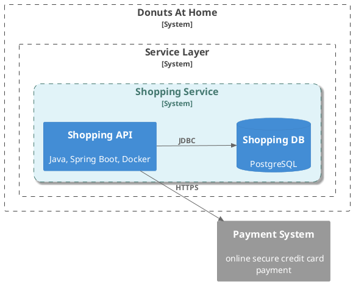
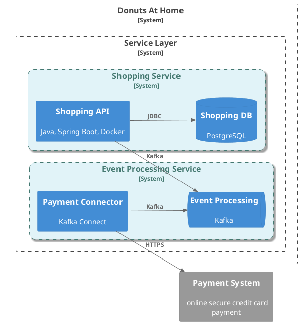
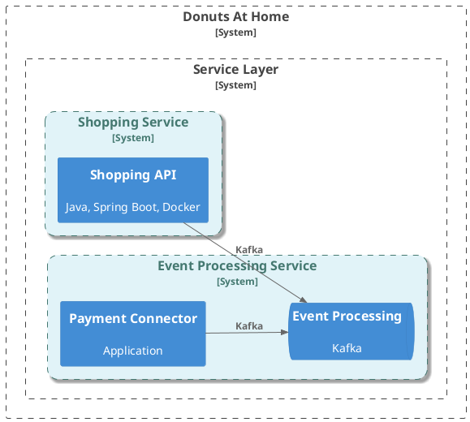
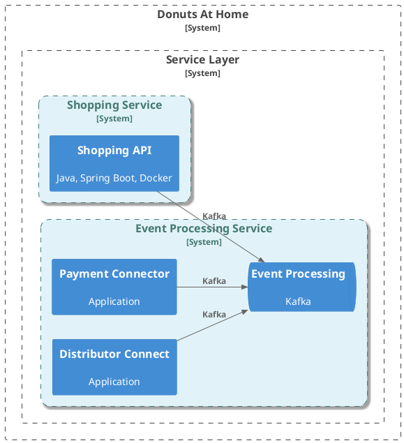

# Messageries asynchrones

--- 

Les architectures microservices offrent leur capacité à décomposer les applications en services indépendants et faiblement couplés. 
La communication entre les services est cruciale pour le fonctionnement harmonieux de l'ensemble du système. 

Deux approches principales existent pour orchestrer cette communication : les messageries synchrones (API) et asynchrones. 

Ces dernières améliorent la résilience, la scalabilité et la flexibilité des architectures microservices.

--- 
layout: two-cols
--- 

## Qu'est-ce qu'une messagerie asynchrone ?

### Transaction synchrone 

::right::

### Transaction asynchrone 

---
layout: two-cols
---

## Pourquoi les utiliser ?

* Les ressources sont libérées plus rapidement
* Résilience accrue
* Scalabilité
* Faible Couplage

## Composants

* Bus de message/Queue
* Producteurs
* Consommateurs

## Exemples

Kakfka, Artemis, RabbitMQ

::right::

---
layout: two-cols
---

## Modèles de communication
### Point-à-Point

::right::

### Publish/Subscribe (Pub/Sub)

---
layout: two-cols 
---

## Avantages 

* Scalabilité améliorée
* Augmente la résilience des plateformes microservices
* Traitement au fil de l'eau des évènements

::right::

## Inconvénients

* La consistence des données est compliquée à mettre en oeuvre
* La gestion des erreurs est plus compliquée
* Il faut superviser le système de messagerie et gérer les cas ou la file d'attente est saturée 

