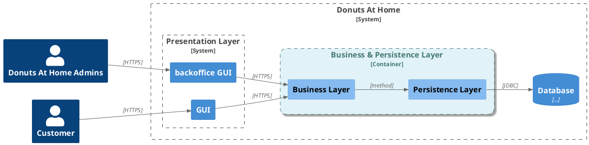
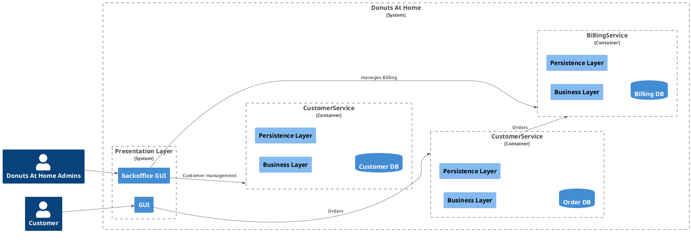
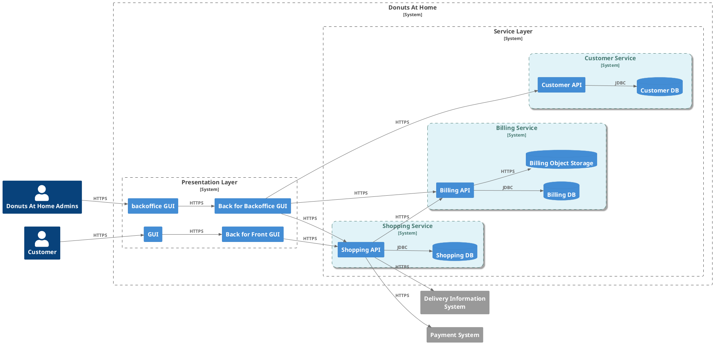

# Transactions distribuées

---

## Rappels : ACID

* Atomicité
* Cohérence
* Isolation
* Durabilité

Source: Wikipedia [@acid]

--- 

## Comment faire dans une architecture distribuée ?
### Exemple

Si dans l'appel à ``BillingService`` échoue:
* Comment traiter les erreurs et garantir la cohérence des données dans ``CustomerService`` ?
* Comment piloter une transaction de bout en bout ? 

---
layout: center
---
## Les Long Running Actions

### Définition

Les "long running actions" dans le contexte des microservices sont des opérations qui durent longtemps, souvent beaucoup plus que la durée typique d'une requête HTTP. 

Ces opérations prolongées peuvent inclure des traitements complexes, des calculs intensifs, la génération de rapports, l'intégration avec des systèmes externes, la migration de données, etc. 

Gérer ces actions efficacement est crucial pour maintenir la performance, la scalabilité et la résilience de l'ensemble du système de microservices.

---

### Exemple

### Caractéristiques

| Durée prolongée| Complexité | État Intermédiaire  | Scalabilité | Tolérance aux Erreurs 
| --- | --- | --- |--- | --- |

<!--
Durée Prolongée : Ces actions peuvent prendre des secondes, des minutes, voire des heures pour se terminer.
Complexité : Souvent impliquent des opérations complexes avec plusieurs étapes ou dépendances.
État Intermédiaire : Les actions prolongées peuvent nécessiter la gestion de l'état intermédiaire pour assurer la reprise après une interruption.
Scalabilité : Doivent pouvoir être mises à l'échelle horizontalement, par exemple en ajoutant des instances supplémentaires de services worker.
Tolérance aux Erreurs : Doivent gérer les échecs de manière appropriée et pouvoir redémarrer ou compenser les opérations échouées.

-->
---

## Les Long Running Actions en Java

### Modèle

* 
* 

---

## Le pattern SAGA

[@saga-pattern]

Source: [Microservices Patterns](https://microservices.io/patterns/data/saga.html)