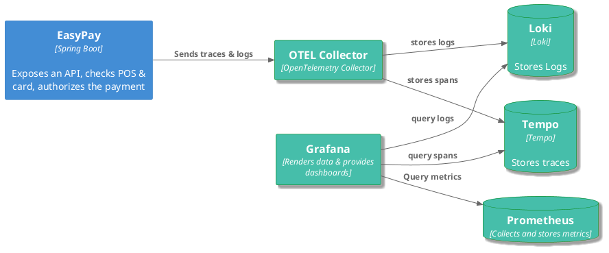

# L'observabilité

> L'observabilité est la capacité à comprendre l'état interne d'un système complexe. Lorsqu'un système est observable, un utilisateur peut identifier la cause première d'un problème de performance en examinant les données qu'il produit, sans tests ou codage supplémentaires.
> 
> C'est l'un des moyens par lesquels les problèmes de qualité de service peuvent être abordés.

---

## Logs, Traces et Monitoring


## Pourquoi ces éléments sont indispensables dans notre contexte ?

* Complexité 
* Détection des problèmes
* Diagnostic et dépannage
* Optimisation de la performance
* Visibilité de bout en bout
* Conformité et sécurité


<!-- 

Complexité Accrue :

Les architectures distribuées, composées de nombreux microservices, augmentent la complexité des systèmes. L'observabilité aide à comprendre et à gérer cette complexité.
Détection Précoce des Problèmes :

Permet d'identifier rapidement les anomalies et les défaillances avant qu'elles n'affectent les utilisateurs finaux, réduisant ainsi le temps de résolution des incidents.
Diagnostic et Dépannage :

Facilite le suivi et le diagnostic des problèmes de performance et des interruptions de service en fournissant des informations détaillées sur l'état interne de chaque composant et leurs interactions.
Optimisation de la Performance :

Aide à identifier les goulets d'étranglement et à optimiser les performances des systèmes en fournissant des données précises sur les temps de réponse et l'utilisation des ressources.
Amélioration Continue :

Les métriques et les logs récoltés permettent de comprendre les comportements des systèmes et d'identifier des pistes d'amélioration continue, renforçant ainsi la fiabilité et l'efficacité des services.
Réponse Rapide aux Incidents :

En fournissant une visibilité en temps réel, l'observabilité permet de réagir rapidement aux incidents et de minimiser les interruptions de service.
Visibilité End-to-End :

Offre une vue globale sur le fonctionnement de l'ensemble des services et de leurs interactions, assurant ainsi une compréhension complète du flux de données à travers le système.
Conformité et Sécurité :

Facilite la surveillance des activités suspectes et le respect des réglementations en matière de sécurité et de confidentialité en fournissant des pistes d'audit détaillées.
Rationalisation du Développement et des Opérations :

Les équipes de développement et d'opérations peuvent collaborer plus efficacement grâce à une visibilité partagée sur l'état du système, améliorant ainsi la qualité du service.
Support à la Scalabilité :

Aide à gérer la scalabilité des systèmes distribués en fournissant des informations sur l'utilisation des ressources et en identifiant les besoins d'ajustements en temps réel.
-->


---
layout: two-cols
---

### Les logs

Les logs (ou traces applicatives) sont des enregistrements chronologiques d'événements survenus dans une application ou un système. 

Ils servent à fournir des informations détaillées sur les actions exécutées, les erreurs rencontrées et l'état du système à différents moments. 

::right::

Quel log est utile ?
```java
System.out.println("Je suis ici...");
``` 

ou 

```java
LOG.warn("Check card expiry date does not pass: bad format: {}", expiryDate);
```

Un exemple de log dans un format structuré:


--- 

#### Principes clés

* Distinguer les logs de développement (utilisés pour le débogage) des logs de production.
* Utiliser les niveaux de log appropriés (``DEBUG``, ``INFO``, ``WARN``, ``ERROR``, etc.).
* Fournir des messages clairs et utiles pour les OPS.
* Inclure le contexte métier pertinent (par exemple, l'échec de la création du contrat 123456).
* Assurer que les logs puissent être lus par un outil externe (comme un agrégateur de logs).
* Ne pas exposer de données sensibles dans les logs en respectant les normes de confidentialité telles que GDPR et PCI DSS.


---

#### Les agrégateurs de logs


---
layout: two-cols
---

### Les traces distribuées

1. Suivi des transactions de bout en bout
2. Corrélation des logs
3. Détection et isolation des problèmes
4. Contexte global
5. Optimisation de la Performance

::right::
<div v-click class="text-xl"> Attention aux performances! </div>

<!-- 
1. Suivi des transactions de bout en bout: Permet de suivre le parcours complet d'une transaction à travers différents services et microservices.
2. Corrélation des logs: Facilite la liaison des événements liés entre différents composants du système.
3. Détection et isolation des problèmes: Aide à identifier rapidement l'origine des problèmes de performance ou des erreurs.
4. Contexte global: Fournit une vue d'ensemble sur l'interaction entre services, incluant les temps de réponse et les dépendances.
5. Optimisation de la Performance: Aide à repérer les goulets d'étranglement et à optimiser le temps de réponse global du système.

-->
---


--- 

### Un exemple d'implémentation

Une application de paiement basée sur des microservices 

```plantuml
@startuml   architecture
!include <C4/C4_Container>
!include <C4/C4_Context>
!include <C4/C4_Component>
AddContainerTag("grafana", $bgColor="46beaa",$borderColor="green", $fontColor="white", $shadowing="true")
LAYOUT_LANDSCAPE()
HIDE_STEREOTYPE()

Person(customerA, "Customer", "A customer")
System_Ext(smartBankGateway,"Smart Bank Gateway")
        Container_Boundary(b1,"Easy Pay System"){
            Container(gateway,"API Gateway","Spring Cloud Gateway","Exposes the APIs")
            Container(easypay,"EasyPay","Spring Boot","Exposes an API, checks POS & card, authorizes the payment")
            Container(merchantBo,"Merchant Back Office")
            Container(fraudDetect,"Fraud Detection")
            ContainerDb(database,"PostgreSQL","PostgreSQL")
            ContainerDb(database1,"PostgreSQL","PostgreSQL")
            ContainerDb(database2,"PostgreSQL","PostgreSQL")
            ContainerQueue(kafka,"kafka","kafka")
'            Container(collector,"OTEL Collector","OpenTelemetry Collector",$tags="grafana")
            Container(discoveryServer,"Discovery Server")
            Container(configurationServer,"Configuration Server")
'            ContainerDb(tempo,"Tempo","Tempo","Stores traces",$tags="grafana")
'            Container(grafana,"Grafana","Renders data & provides dashboards",$tags="grafana")
'            ContainerDb(prometheus,"Prometheus", "Collects and stores metrics",$tags="grafana")
        }
      Rel(customerA,gateway,"Calls an API")
      Rel(gateway,easypay,"HTTPS")
      Rel(easypay, database,"JDBC")
      Rel(easypay, kafka,"kafka","Broadcasts payment information")
      Rel(merchantBo, kafka,"kafka","Gets payments")
      Rel(fraudDetect, kafka,"kafka","Gets payments")
      Rel(merchantBo, database1,"JDBC")
      Rel(fraudDetect, database2,"JDBC")
'      Rel(prometheus,easypay,"Grabs metrics")
'      Rel(gateway,collector,"broadcasts spans")
'      Rel(merchantBo,collector,"broadcasts spans")
'      Rel(fraudDetect,collector,"broadcasts spans")
'      Rel(easypay,collector,"broadcasts spans")
      Rel(easypay,smartBankGateway,"Sends payment")
'      Rel(collector,tempo,"stores spans")
'      Rel(grafana, prometheus,"Query metrics")
'      Rel(grafana,tempo,"query spans")
'      Lay_D(grafana, collector)
      Lay_L(fraudDetect,kafka)
      Lay_L(merchantBo,kafka)
@enduml

```



---

##### Utilisation de la plateforme Grafana

* Loki[@loki] va stocker les logs
* Tempo[@tempo] va stocker les traces
* OTEL Collector[@otel-collector] va collecter les logs et traces
* Grafana[@grafana-stack] va permettre l'affichage et la recherche

```plantuml
@startuml   architecture
!include <C4/C4_Container>
!include <C4/C4_Context>
!include <C4/C4_Component>
AddContainerTag("grafana", $bgColor="46beaa",$borderColor="green", $fontColor="white", $shadowing="true")
LAYOUT_LANDSCAPE()
HIDE_STEREOTYPE()

Person(customerA, "Customer", "A customer")
System_Ext(smartBankGateway,"Smart Bank Gateway")
        Container_Boundary(b1,"Easy Pay System"){
            Container(gateway,"API Gateway","Spring Cloud Gateway","Exposes the APIs")
            Container(easypay,"EasyPay","Spring Boot","Exposes an API, checks POS & card, authorizes the payment")
            Container(merchantBo,"Merchant Back Office")
            Container(fraudDetect,"Fraud Detection")
            ContainerDb(database,"PostgreSQL","PostgreSQL")
            ContainerDb(database1,"PostgreSQL","PostgreSQL")
            ContainerDb(database2,"PostgreSQL","PostgreSQL")

            ContainerQueue(kafka,"kafka","kafka")
            Container(collector,"OTEL Collector","OpenTelemetry Collector",$tags="grafana")
            Container(discoveryServer,"Discovery Server")
            Container(configurationServer,"Configuration Server")
            ContainerDb(tempo,"Tempo","Tempo","Stores traces",$tags="grafana")
            ContainerDb(loki,"Loki","Loki","Stores Logs",$tags="grafana")
            Container(grafana,"Grafana","Renders data & provides dashboards",$tags="grafana")
            ContainerDb(prometheus,"Prometheus", "Collects and stores metrics",$tags="grafana")
        }
      Rel(customerA,gateway,"Calls an API")
      Rel(gateway,easypay,"HTTPS")
      Rel(easypay, database,"JDBC")
      Rel(easypay, kafka,"kafka","Broadcasts payment information")
      Rel(merchantBo, kafka,"kafka","Gets payments")
      Rel(fraudDetect, kafka,"kafka","Gets payments")
      Rel(prometheus,easypay,"Grabs metrics")
      Rel(prometheus,fraudDetect,"Grabs metrics")
      Rel(prometheus,merchantBo,"Grabs metrics")
      Rel(prometheus,gateway,"Grabs metrics")
      Rel(merchantBo, database1,"JDBC")
            Rel(fraudDetect, database2,"JDBC")
      Rel(gateway,collector,"broadcasts spans & logs")
      Rel(merchantBo,collector,"broadcasts spans & logs")
      Rel(fraudDetect,collector,"broadcasts spans & logs")
      Rel(easypay,collector,"broadcasts spans")
      Rel(easypay,smartBankGateway,"Sends payment")
      Rel(collector,tempo,"stores spans")
      Rel(collector,loki,"stores logs")
      Rel(grafana, prometheus,"Query metrics")
      Rel(grafana,tempo,"query spans")
      Rel(grafana,loki,"query logs")
'      Lay_D(grafana, collector)
      Lay_L(fraudDetect,kafka)
      Lay_L(merchantBo,kafka)
@enduml

```





---

##### Zoom sur un service

