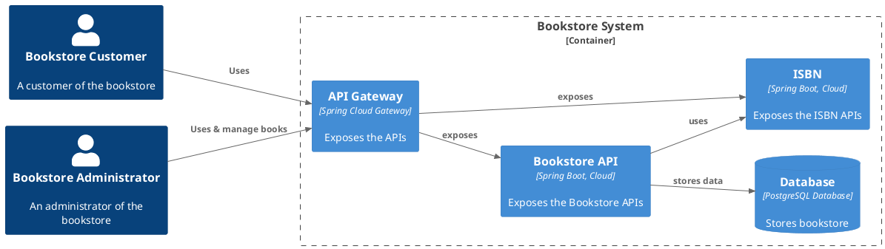
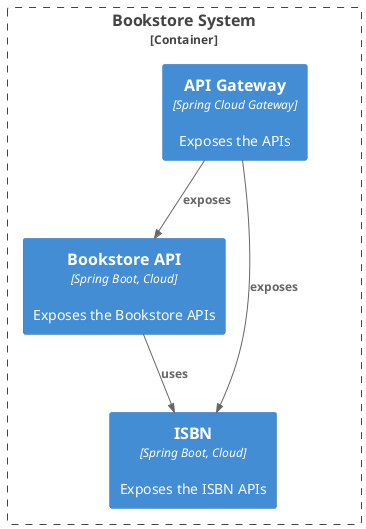
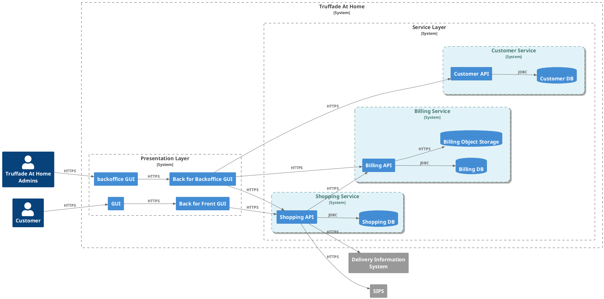
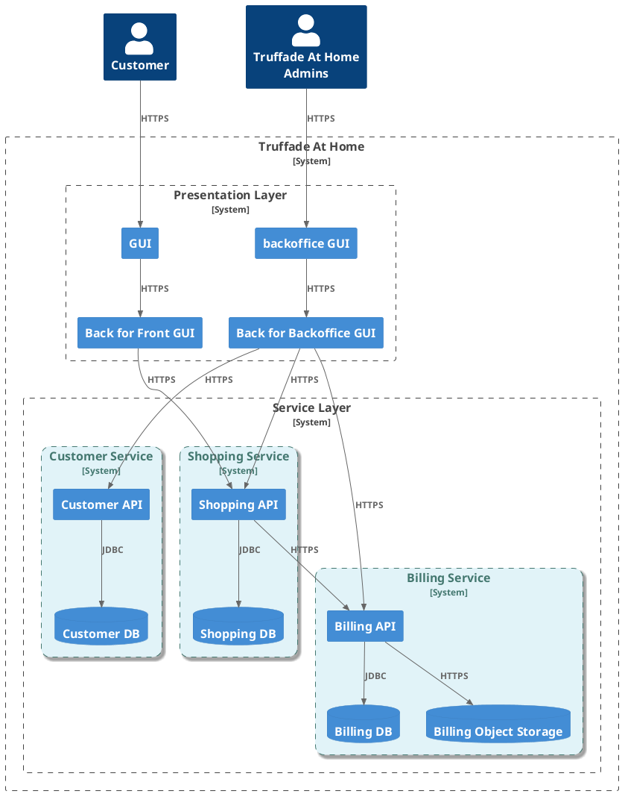

# Autres Patterns

[https://microservices.io/patterns/index.html](https://microservices.io/patterns/index.html) 

::right::

---

## L' API Gateway

[Exemple chez NetFlix](https://netflixtechblog.com/optimizing-the-netflix-api-5c9ac715cf19)[@netflix-api-gateway]

---
layout: two-cols
---

### Principes clés d'une API Gateway

1. Gestion Centralisée des API
2.  Routage
3.  Sécurité
4.  Transformation des Requêtes et des Réponses
6.  Rate Limiting et Throttling
7.  Caching
8.  Surveillance et Journalisation
9.  Haute Disponibilité et Scalabilité
10. Gestion des Versions d'API
11. Gestion des Erreurs
12. Compatibilité Multi-protocoles

::right::

<!-- 

### Principes Clés d'une API Gateway

1. **Gestion Centralisée des API** :
   - Agit comme un point d'entrée unique pour toutes les requêtes client, simplifiant l'accès et la gestion des API multiples.

2. **Routage** :
   - Acheminement intelligent des requêtes vers les services backend appropriés en fonction de la logique de routage définie.

3. **Sécurité** :
   - Authentification, autorisation et protection contre les attaques telles que les DDoS. Intégration facile avec des systèmes de gestion des identités (OAuth, JWT).

4. **Transformation des Requêtes et des Réponses** :
   - Modifie les requêtes entrantes et les réponses sortantes pour correspondre aux spécifications des services backend ou des clients.

5. **Agrégation** :
   - Combine les réponses de plusieurs services backend en une seule réponse unifiée pour les clients.

6. **Limitation de Taux et Throttling** :
   - Contrôle du flux de requêtes en limitant le nombre de requêtes par unité de temps, protégeant ainsi les services backend contre la surcharge.

7. **Caching** :
   - Mise en cache des réponses pour réduire la charge sur les services backend et améliorer les temps de réponse.

8. **Surveillance et Journalisation** :
   - Collecte des métriques, journalisation des requêtes et des réponses, et offre des capacités de suivi et d'audit.

9. **Haute Disponibilité et Scalabilité** :
   - Construit pour gérer de grandes infrastructures avec équilibrage de charge et failover pour assurer une disponibilité continue.

10. **Gestion des Versions d'API** :
    - Permet de gérer différentes versions d'API simultanément, facilitant la transition entre les versions et gardant la rétrocompatibilité.

11. **Gestion des Erreurs** :
    - Centralise la gestion des erreurs et fournit des messages d'erreur cohérents et significatifs aux clients.

12. **Compatibilité Multi-protocole** :
    - Supporte différents protocoles comme HTTP, WebSocket, gRPC, facilitant l'intégration avec divers types de services backend.

13. **Extensibilité** :
    - Permet l'ajout de plugins ou d'extensions pour étendre ses fonctionnalités selon les besoins spécifiques des applications et des services.

Ces principes permettent à une API Gateway de servir de brique essentielle dans une architecture de microservices, en simplifiant l'interaction entre les clients et les services backend tout en améliorant la sécurité, la performance et la gestion des API.
-->

---

## Back For Front (BFF)

Un exemple:

---
layout: two-cols
---

### Principles Clés d'un BFF

1. Personnalisation des API
2. Séparation des Préoccupations (_Separation of concerns_)
3. Réduction de la Complexité du Frontend
4. Optimisation des Performances
5. Transformation des Données
6. Gestion des Échecs et des Erreurs
7. Agilité et Flexibilité
8. Sécurité
9. Gestion des Dépendances
10. Réutilisation

::right::

<!-- 
### Backends for Frontends (BFF) : Explication et Principes

Le modèle "Backend for Frontend" (BFF) est une architecture de conception où des backends spécifiques sont créés pour les besoins des différentes interfaces utilisateur (frontends) d'une application. 

#### Principes Clés d'un BFF

1. **Personnalisation des API** :
   - Un BFF permet de créer des API sur mesure adaptées aux besoins spécifiques de chaque frontend (mobile, web, desktop, etc.), offrant ainsi des réponses optimisées et pertinentes.

2. **Séparation des Préoccupations** :
   - En isolant la logique backend spécifique à chaque frontend, le BFF permet de maintenir une séparation claire des préoccupations, facilitant ainsi la gestion et l'évolution des différentes parties de l'application.

3. **Réduction de la Complexité du Frontend** :
   - Le BFF gère la complexité de la communication avec les différents microservices du backend, permettant ainsi au frontend de rester simple et léger.

4. **Optimisation des Performances** :
   - Les BFF peuvent être optimisés pour les besoins spécifiques de chaque type de frontend en termes de latence, mise en cache, et transformation des données, améliorant ainsi les performances globales de l'application.

5. **Transformation des Données** :
   - Le BFF peut transformer les formats de données provenant des microservices backend pour qu'ils correspondent aux besoins du frontend, ce qui évite au frontend de faire des transformations complexes.

6. **Gestion des Échecs et des Erreurs** :
   - Centralisation de la gestion des échecs et des erreurs spécifiques à chaque type d'interface utilisateur, permettant des réponses plus cohérentes et adaptées à l'expérience utilisateur.

7. **Agilité et Flexibilité** :
   - Permet de développer et de déployer des fonctionnalités spécifiques à chaque frontend indépendamment, facilitant ainsi les itérations rapides et l'adoption de nouvelles technologies.

8. **Sécurité** :
   - Ajoute une couche supplémentaire de sécurité en gérant l'authentification et l'autorisation de manière spécifique pour chaque frontend, tout en réduisant les surfaces d'attaque.

9. **Gestion des Dépendances** :
   - Simplifie la gestion des dépendances et les interactions avec les services backend, car chaque BFF peut interagir avec plusieurs services backend de manière centralisée.

10. **Réutilisation** :
    - Favorise la réutilisation de la logique métier commune entre différents frontends, tout en permettant de personnaliser spécifiquement ce qui est nécessaire pour chaque type d'interface.

#### Exemples d'utilisation

- **Applications mobiles** : Un BFF optimisé pour les contraintes de réseau des applications mobiles (par exemple, agrégation des données pour minimiser les requêtes réseau).
- **Applications web** : Un BFF qui offre des endpoints spécifiques pour les besoins de navigation rapide et les interactions riches d'une application web.
- **Applications desktop** : Un BFF adapté aux besoins spécifiques d'une application desktop en termes de traitement et de présentation des données.

En résumé, le modèle BFF est particulièrement utile dans les architectures modernes de microservices où les besoins des différents frontends peuvent varier considérablement. Il permet de rationaliser les interactions entre les clients et le backend, d'améliorer les performances, et de personnaliser les services pour offrir une meilleure expérience utilisateur.
-->

