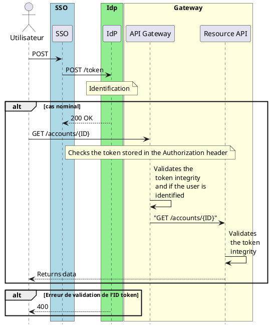

# Sécurité des architectures microservices

---

## Principaux défis

* Décentralisation
* Multiplicité des points d’accès et d’exposition
* Complexité des communications inter-services sécurisées
* Gestion des secrets et des configurations sécurisées
* Sécurisation des données en transit et au repos

---
layout: two-cols
---

## Authentification 

L’authentification est le processus de vérification de l’identité d'un utilisateur ou d'un service pour s'assurer qu’il est bien celui qu’il prétend être.

Dans une architecture microservices, chaque requête doit être authentifiée avant d'accéder aux ressources pour éviter l'accès non autorisé.

Protocoles: OpenID Connect

::right::

## Autorisation

L’autorisation est le processus de contrôle d'accès aux ressources ou actions en fonction des droits d'un utilisateur ou d'un service. 

Après l’authentification, l'autorisation permet de déterminer les actions qu'un utilisateur est habilité à effectuer. 

Dans une architecture microservices, chaque service doit vérifier l’autorisation de l’utilisateur pour garantir un accès sécurisé et approprié.

Protocoles: OAuthv2


---
layout: two-cols
---

## Authentification avec JSON Web Token (JWT)

1. Connexion de l'utilisateur 
2. Vérification des identifiants
3. Création d'un jeton 
4. Envoi du fichier à l'utilisateur
5. Vérification et utilisation du jeton dans toutes les requêtes avec l'en-tête ``Àuthorization: Bearer <token>``

::right::



---
layout: two-cols
---

### Anatomie d'un jeton JWT

Les JWT sont définis par la RFC 7519[@rfc-7519] Ils sont composés de trois parties :

* Header : Contient des informations sur le type de token (JWT) et l'algorithme de signature utilisé.
* Payload : Contient les informations ou claims de l’utilisateur (ex., ID, rôle, permissions).
* Signature : Une signature générée avec la clé secrète, qui garantit l’intégrité du token.

La version encodée :

```
eyJhbGciOiJIUzI1NiIsInR5cCI6IkpXVCJ9.eyJzdWIiOiIxMjM0NTY3ODkwIiwi 
bmFtZSI6IkpvaG4gRG9lIiwiaWF0IjoxNTE2MjM5MDIyfQ.SflKxwRJSMeKKF2Q T  
4fwpMeJf36POk6yJV_adQssw5c 
```

Pour valider des JWT : [https://jwt.io/](https://jwt.io/)

::right::

L' en-tête

```
eyJhbGciOiJIUzI1NiIsInR5cCI6IkpXVCJ9  
  
{  
  "alg": "HS256",  
  "typ": "JWT"  
} 
```

Le Payload

```
eyJzdWIiOiIxMjM0NTY3ODkwIiwibmFtZSI6IkpvaG4gRG9lIiwiaWF0IjoxNTE2MjM5MDIyfQ  
  
{  
  "sub": "1234567890",  
  "name": "John Doe",  
  "iat": 1516239022  
} 
```

La signature

```
SflKxwRJSMeKKF2QT4fwpMeJf36POk6yJV_adQssw5c 
```


<!-- 
Dans le contexte des microservices, la sécurité est essentielle car chaque service expose des interfaces, communique avec d'autres services, et manipule potentiellement des données sensibles. Voici les principales notions de sécurité qui devraient être abordées dans un cours universitaire sur les microservices :

### 1. **Authentification et autorisation**

   - **Authentification** : Garantir que seuls les utilisateurs ou services autorisés peuvent accéder aux microservices. L’authentification basée sur *tokens* (par exemple, JSON Web Tokens - JWT) est souvent utilisée pour vérifier l’identité des utilisateurs et services.
   - **Autorisation** : S’assurer que les utilisateurs et services authentifiés ne peuvent accéder qu’aux ressources qui leur sont permises. Le *Role-Based Access Control* (RBAC) et l’*Attribute-Based Access Control* (ABAC) permettent de définir des permissions par rôle ou par attributs.

   > **Bonnes pratiques** : Utiliser des solutions centralisées comme OAuth 2.0 et OpenID Connect pour gérer l’authentification et déléguer les autorisations.

### 2. **API Gateway et sécurité des communications**

   - **API Gateway** : Elle sert de point d'entrée unique, permettant de gérer l'authentification, l’autorisation, la limitation de débit (rate limiting), et d'appliquer des règles de sécurité. Elle agit également comme un pare-feu d'application (Web Application Firewall - WAF) en bloquant les requêtes malveillantes.
   - **Chiffrement des communications** : Assurer que toutes les communications entre les microservices et avec les clients soient chiffrées (TLS/SSL). Cela empêche les attaques de type *man-in-the-middle* et assure la confidentialité des données transmises.

   > **Bonnes pratiques** : Utiliser HTTPS pour toutes les communications et configurer des certificats SSL pour chaque microservice.

### 3. **Isolation des services et des données**

   - **Isolation des services** : Limiter les interactions directes entre microservices pour minimiser l’impact en cas de compromission d’un service. Les services doivent communiquer via des API ou des messages asynchrones, avec des politiques de sécurité précises.
   - **Séparation des données** : Chaque microservice doit gérer ses propres données. Une isolation des bases de données permet d’empêcher qu’un service compromette directement les données d’un autre.

   > **Bonnes pratiques** : Éviter les accès directs aux bases de données d’autres services et restreindre les autorisations pour chaque service.

### 4. **Sécurité des données en transit et au repos**

   - **Données en transit** : Chiffrer les données en transit entre microservices et avec les clients pour protéger les informations sensibles. Le chiffrement des canaux de communication (HTTPS, TLS) empêche les attaques d’interception.
   - **Données au repos** : Chiffrer les bases de données et les systèmes de stockage pour éviter le vol de données en cas de compromission. Utiliser des clés de chiffrement robustes et les protéger avec des solutions de gestion de clés.

   > **Bonnes pratiques** : Mettre en œuvre une gestion centralisée des clés et chiffrer systématiquement toutes les données sensibles au repos.

### 5. **Gestion des secrets**

   - Les microservices utilisent souvent des identifiants, mots de passe et clés d’API pour accéder à des ressources et à d’autres services. La gestion sécurisée des secrets est cruciale pour éviter que des informations sensibles soient exposées.
   - Utiliser un *vault* (ex. HashiCorp Vault, AWS Secrets Manager) pour stocker et accéder aux secrets de manière sécurisée.

   > **Bonnes pratiques** : Ne jamais coder les secrets en dur dans le code source et limiter l'accès aux secrets uniquement aux services autorisés.

### 6. **Journaux d’audit et surveillance**

   - **Journaux d’audit** : Garder une trace des actions critiques effectuées par les utilisateurs et les services pour pouvoir détecter d’éventuelles activités suspectes ou compromises.
   - **Surveillance des anomalies** : Mettre en place une surveillance en temps réel pour détecter des comportements anormaux (augmentation des appels d’API, tentatives de connexion suspectes). Les outils de SIEM (Security Information and Event Management) permettent une surveillance centralisée et automatisée.

   > **Bonnes pratiques** : Configurer les journaux pour capturer les actions sensibles et les envoyer à un serveur central pour analyse.

### 7. **Contrôle des accès réseau et pare-feu**

   - **Contrôle des accès réseau** : Restreindre les accès réseau entre les microservices pour limiter les chemins d’accès potentiels en cas de compromission. Configurer des réseaux privés virtuels (VPN) pour les communications internes.
   - **Pare-feu et segmentations** : Utiliser des pare-feux et des règles de segmentation pour limiter la visibilité des microservices entre eux et depuis l'extérieur. Une segmentation réseau stricte empêche un attaquant de se déplacer latéralement dans l’architecture.

   > **Bonnes pratiques** : Mettre en œuvre des contrôles réseau de type *zero trust* pour vérifier chaque communication entre microservices.

### 8. **Gestion des vulnérabilités et mises à jour**

   - **Mises à jour** : Les microservices, souvent exécutés dans des conteneurs, doivent être régulièrement mis à jour pour corriger les vulnérabilités de sécurité.
   - **Analyse des vulnérabilités** : Utiliser des scanners de sécurité pour analyser le code, les bibliothèques et les conteneurs afin d’identifier et corriger les vulnérabilités potentielles avant le déploiement.

   > **Bonnes pratiques** : Automatiser les scans de sécurité et les mises à jour dans le pipeline de CI/CD pour garantir que seules les versions sûres des services sont déployées.


En conclusion, l'approche sécuritaire des microservices repose sur une combinaison de bonnes pratiques, d’outils et de politiques visant à réduire les surfaces d’attaque et à assurer une protection proactive.
-->